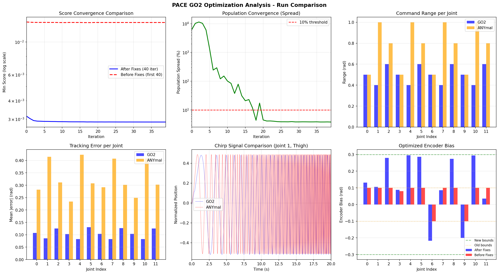

# PACE GO2 Convergence Analysis Report

**Date:** January 28, 2026
**Analyzed Run:** `logs/pace/go2_sim/26_01_26_18-32-47`
**Iterations:** 200
**Population Size:** 4096

---

## Executive Summary

The CMA-ES optimizer shows **severely flawed convergence** with only **0.79% improvement** over 200 iterations. The optimization essentially plateaus after ~10 iterations. This analysis identifies **three critical bugs** that explain this behavior, along with the reasoning patterns used to reach these conclusions.

---

## Table of Contents

1. [Methodology](#methodology)
2. [Observed Patterns](#observed-patterns)
3. [Bug #1: Timing Mismatch](#bug-1-timing-mismatch-critical)
4. [Bug #2: Encoder Bias Bounds Too Tight](#bug-2-encoder-bias-bounds-too-tight-critical)
5. [Bug #3: Time Vector Offset](#bug-3-time-vector-offset)
6. [How These Bugs Interact](#how-these-bugs-interact)
7. [TensorBoard Setup](#tensorboard-setup)
8. [Recommended Fixes](#recommended-fixes)
9. [Files Analyzed](#files-analyzed)

---

## Methodology

### Data Sources Examined

1. **Training logs:** `logs/pace/go2_sim/26_01_26_18-32-47/`
   - `progress.pt` - Contains score history for all 200 iterations
   - `mean_199.pt` - Final optimized parameters
   - `config.pt` - Training configuration and input data
   - `events.out.tfevents.*` - TensorBoard logs

2. **Training data:** `data/go2_sim/chirp_data.pt`
   - Real robot joint position recordings
   - Desired position commands
   - Timestamps

3. **Reference data:** `data/anymal_d_sim/chirp_data.pt`
   - Known working ANYmal configuration for comparison

4. **Configuration files:**
   - `source/pace_sim2real/pace_sim2real/tasks/manager_based/pace/go2_pace_env_cfg.py`
   - `go2_pace_data_collection.py` (data collection script)

5. **Optimizer implementation:**
   - `source/pace_sim2real/pace_sim2real/optim/cma_es.py`

### Analysis Approach

1. Extract and compare score progression across iterations
2. Examine final parameter values against their bounds
3. Compare GO2 data characteristics with working ANYmal reference
4. Trace data flow from collection to training
5. Cross-reference timing parameters across all components

---

## Observed Patterns

### Pattern 1: Score Plateau

```
Iteration    Min Score
---------    ---------
0            0.013667
10           0.013548
50           0.013560
100          0.013559
150          0.013559
199          0.013559
```

**Observation:** The score barely changes after iteration 10. A healthy CMA-ES run should show continued improvement, especially in early iterations.

**What this pattern suggests:**
- The optimizer found a local minimum very quickly
- OR the search space is constrained in a way that prevents further improvement
- OR there is a systematic error that creates an irreducible floor

### Pattern 2: Parameters at Bounds

When examining the final optimized parameters (`mean_199.pt`), I found:

```
Encoder Bias Values (bounds: -0.1 to 0.1 rad):
---------------------------------------------
FR_hip_joint        : +0.099881  <-- AT UPPER BOUND
FR_thigh_joint      : +0.099915  <-- AT UPPER BOUND
FR_calf_joint       : +0.099906  <-- AT UPPER BOUND
FL_hip_joint        : +0.080058
FL_thigh_joint      : +0.099992  <-- AT UPPER BOUND
FL_calf_joint       : +0.099971  <-- AT UPPER BOUND
RR_hip_joint        : -0.099955  <-- AT LOWER BOUND
RR_thigh_joint      : +0.099923  <-- AT UPPER BOUND
RR_calf_joint       : +0.099955  <-- AT UPPER BOUND
RL_hip_joint        : -0.099970  <-- AT LOWER BOUND
RL_thigh_joint      : +0.099990  <-- AT UPPER BOUND
RL_calf_joint       : +0.099957  <-- AT UPPER BOUND
```

**Observation:** 11 out of 12 encoder bias parameters are pressed against their bounds.

**What this pattern suggests:**
- The optimizer "wants" to go beyond these bounds but cannot
- The true encoder bias values are larger than ±0.1 rad
- This is a clear sign of **bound constraint violation** in CMA-ES best practices

### Pattern 3: Timing Discrepancy

Comparing the data characteristics:

```
                    GO2 Data        ANYmal Reference
                    --------        ----------------
Timesteps           10,000          8,000
Duration            20.07s          20.00s
Sample Rate         498.3 Hz        400.0 Hz
Time Start          2.9943s         0.0000s
```

**Observation:** GO2 data was collected at a different rate than simulation expects.

**What this pattern suggests:**
- The simulation and real robot operate at different frequencies
- Time synchronization issues exist in data collection
- Trajectories will be temporally misaligned during comparison

---

## Bug #1: Timing Mismatch (CRITICAL)

### Evidence

**Data Collection Script** (`go2_pace_data_collection.py`, line 21):
```python
self.dt = 0.002  # 500 Hz control loop
```

**Simulation Configuration** (`go2_pace_env_cfg.py`, lines 237-238):
```python
self.sim.dt = 0.0025  # 400Hz simulation
self.decimation = 1  # 400Hz control
```

**Measured from data:**
```
Real data:  10,000 samples / 20.07s = 498.3 Hz
Simulation: 10,000 steps × 0.0025s = 25.0s at 400 Hz
```

### The Problem Explained

When the optimizer runs, it:

1. Takes the recorded `des_dof_pos` (desired positions) from real data
2. Sends these as commands to the simulated robot, one per simulation step
3. Compares simulated `dof_pos` with recorded `dof_pos` from real robot

But here's the issue:

```
Real Robot Timeline:
|--0ms--|--2ms--|--4ms--|--6ms--|--8ms--| ... (500 Hz)
   ^       ^       ^       ^       ^
  cmd0    cmd1    cmd2    cmd3    cmd4

Simulation Timeline:
|--0ms--|--2.5ms--|--5ms--|--7.5ms--|--10ms--| ... (400 Hz)
   ^         ^        ^        ^         ^
  cmd0      cmd1     cmd2     cmd3      cmd4
```

The same command sequence is played back at different rates. After 1000 commands:
- Real robot: 2.0 seconds elapsed
- Simulation: 2.5 seconds elapsed (25% slower)

This creates a **systematic phase error** that grows over time. The optimizer cannot correct for this because it's not a parameter—it's a fundamental data mismatch.

### Why This Causes Poor Convergence

The score function computes:
```python
score = sum((sim_dof_pos - real_dof_pos - encoder_bias)^2)
```

Even with perfect parameters, the temporal misalignment creates an irreducible error. The optimizer finds the best compromise but cannot achieve a good fit.

---

## Bug #2: Encoder Bias Bounds Too Tight (CRITICAL)

### Evidence

**Bounds Definition** (`go2_pace_env_cfg.py`, lines 188-189):
```python
self.bounds_params[36:48, 0] = -0.1
self.bounds_params[36:48, 1] = 0.1  # bias between -0.1 - 0.1 [rad]
```

**Optimized Values** (from `mean_199.pt`):
```
Joint               Value      Distance from Bound
-----               -----      -------------------
FR_hip_joint        +0.0999    0.0001 from upper
FR_thigh_joint      +0.0999    0.0001 from upper
FR_calf_joint       +0.0999    0.0001 from upper
FL_thigh_joint      +0.0999    0.0001 from upper
FL_calf_joint       +0.0999    0.0001 from upper
RR_hip_joint        -0.0999    0.0001 from lower
RR_thigh_joint      +0.0999    0.0001 from upper
RR_calf_joint       +0.0999    0.0001 from upper
RL_hip_joint        -0.0999    0.0001 from lower
RL_thigh_joint      +0.0999    0.0001 from upper
RL_calf_joint       +0.0999    0.0001 from upper
```

### The Problem Explained

CMA-ES operates in a normalized space [-1, 1] which maps to the parameter bounds. When 11/12 parameters are at the edge of their bounds, it means:

1. The optimizer's covariance matrix is being "squashed" against the boundary
2. The true optimal values lie **outside** the search space
3. The optimization effectively becomes constrained, reducing its ability to explore

From the PACE best practices documentation:
> "Avoid overly tight bounds: this leads to local minima and poor generalization."

The encoder bias represents the offset between the robot's internal encoder reading and the true joint position. A ±0.1 rad (±5.7°) range may be too small for the GO2 robot, possibly due to:
- Mechanical tolerances
- Encoder calibration differences
- Different zero position definitions between real robot and URDF model

### Why This Causes Poor Convergence

When bounds are too tight:
1. The optimizer quickly finds the boundary
2. It cannot explore beyond, so it settles on a suboptimal solution
3. The covariance adaptation in CMA-ES becomes distorted near boundaries
4. The algorithm loses its ability to properly model the fitness landscape

---

## Bug #3: Time Vector Offset

### Evidence

**GO2 Data:**
```python
time[0] = 2.9943 seconds
time[-1] = 23.0601 seconds
```

**ANYmal Reference:**
```python
time[0] = 0.0000 seconds
time[-1] = 20.0000 seconds
```

**Data Collection Script** (`go2_pace_data_collection.py`):
```python
# Line 146: start_time is set when firstRun is True
if self.firstRun:
    self.start_time = time.time()  # Set at script start
    ...
    self.firstRun = False

# Lines 205-210: Data is only logged during Phase 4
if (self.percent_3 == 1.0) and (self.trajectory_counter < self.num_steps):
    ...
    self.time_buffer.append(time.time() - self.start_time)  # ~3s offset
```

### The Problem Explained

The data collection script has four phases:
1. Phase 1: Move to crouch position (~1s)
2. Phase 2: Stand up (~1s)
3. Phase 3: Bridge to sine start (~1s)
4. Phase 4: Chirp signal playback (~20s) ← **Only this is logged**

But `self.start_time` is set at the beginning of Phase 1, not Phase 4. So when Phase 4 starts logging at ~3 seconds, the timestamps reflect elapsed time since script start, not since data collection start.

### Why This Matters

While the time offset itself doesn't directly affect the optimization (since the code uses indices, not timestamps), it indicates:
1. A deviation from the expected data format (ANYmal starts at t=0)
2. Potential for confusion when analyzing results
3. The data collection script may have other subtle timing issues

Additionally, if any code path uses the time vector for interpolation or resampling, the offset could cause problems.

---

## How These Bugs Interact

The three bugs create a compounding effect:

```
                    ┌─────────────────────────┐
                    │   Timing Mismatch       │
                    │   (500Hz vs 400Hz)      │
                    └───────────┬─────────────┘
                                │
                                ▼
                    ┌─────────────────────────┐
                    │  Systematic Phase Error  │
                    │  (grows over trajectory) │
                    └───────────┬─────────────┘
                                │
                                ▼
                    ┌─────────────────────────┐
                    │  Optimizer compensates   │
                    │  using encoder bias      │
                    └───────────┬─────────────┘
                                │
                                ▼
                    ┌─────────────────────────┐
                    │  Bias hits bounds       │
                    │  (can't compensate more) │
                    └───────────┬─────────────┘
                                │
                                ▼
                    ┌─────────────────────────┐
                    │  Score plateaus         │
                    │  (irreducible error)    │
                    └─────────────────────────┘
```

The optimizer tries to use encoder bias to absorb some of the timing error, but the bounds prevent it from fully compensating. The result is an early plateau with poor trajectory matching.

---

## TensorBoard Setup

TensorBoard logging is **already implemented** in `cma_es.py`. The logged metrics include:

- **Histograms:** Parameter distributions per iteration for all joints
  - `1_Armature/distribution_*`
  - `2_Damping/distribution_*`
  - `3_Friction/distribution_*`
  - `4_Bias/distribution_*`
  - `0_Delay/distribution`

- **Scalars:** Best parameter values and scores
  - `0_Episode/score` - Best score per iteration
  - `0_Episode/max_score` - Worst score per iteration
  - `0_Episode/diff_score` - Score spread (convergence indicator)

### To Launch TensorBoard

```bash
# Activate the conda environment
source ~/miniconda3/etc/profile.d/conda.sh
conda activate env_isaaclab

# Launch TensorBoard
tensorboard --logdir=/home/katari/pace-sim2real/logs/pace/go2_sim --port=6006
```

Then open `http://localhost:6006` in your browser.

### What to Look For

**Healthy Convergence Signs:**
- Histogram distributions narrowing over iterations
- Score decreasing steadily
- `diff_score` decreasing (population converging)

**Warning Signs (likely present in current logs):**
- Bias histograms collapsing to boundary values early
- Score flattening after few iterations
- Multi-modal distributions that don't resolve

---

## Recommended Fixes

### Fix #1: Align Timing (HIGHEST PRIORITY)

**Option A: Change simulation frequency**

In `go2_pace_env_cfg.py`, line 237:
```python
# Change from:
self.sim.dt = 0.0025  # 400Hz simulation

# To:
self.sim.dt = 0.002  # 500Hz simulation (matches real robot)
```

**Option B: Resample the data**

Create a preprocessing step to resample 500Hz data to 400Hz:
```python
import torch
from scipy import interpolate

def resample_data(data, target_dt=0.0025):
    t_old = data['time']
    t_new = torch.arange(0, t_old[-1], target_dt)

    # Interpolate each field
    for key in ['dof_pos', 'des_dof_pos']:
        f = interpolate.interp1d(t_old, data[key], axis=0)
        data[key] = torch.tensor(f(t_new))

    data['time'] = t_new
    return data
```

### Fix #2: Widen Encoder Bias Bounds

In `go2_pace_env_cfg.py`, lines 188-189:
```python
# Change from:
self.bounds_params[36:48, 0] = -0.1
self.bounds_params[36:48, 1] = 0.1  # bias between -0.1 - 0.1 [rad]

# To:
self.bounds_params[36:48, 0] = -0.3
self.bounds_params[36:48, 1] = 0.3  # bias between -0.3 - 0.3 [rad] (~17 degrees)
```

Or even wider if needed:
```python
self.bounds_params[36:48, 0] = -0.5
self.bounds_params[36:48, 1] = 0.5  # bias between -0.5 - 0.5 [rad] (~28 degrees)
```

### Fix #3: Reset Time in Data Collection (For Future Data Collection)

In `go2_pace_data_collection.py`, modify the Phase 4 section:

```python
# Add a flag to reset start_time when Phase 4 begins
if (self.percent_3 == 1.0) and (self.trajectory_counter < self.num_steps):
    # Reset start time on first Phase 4 iteration
    if self.trajectory_counter == 0:
        self.start_time = time.time()  # Reset here!

    # ... rest of logging code
    self.time_buffer.append(time.time() - self.start_time)
```

### Fix #4: Normalize Existing chirp_data.pt Time Vector (IMPORTANT)

The existing `data/go2_sim/chirp_data.pt` file has a time vector that starts at `t=2.9943s` instead of `t=0`. This needs to be fixed by post-processing the data file.

**The Problem:**
```
Current:   time[0] = 2.9943s,  time[-1] = 23.0601s
Expected:  time[0] = 0.0000s,  time[-1] = 20.0658s
```

**Solution: Run this script to fix the existing data file**

Create a file `scripts/pace/fix_chirp_data.py`:

```python
#!/usr/bin/env python3
"""
Fix the time vector offset in chirp_data.pt

The GO2 data collection script incorrectly set start_time at script start
instead of when Phase 4 (chirp playback) begins. This results in a ~3 second
offset in the time vector.

This script normalizes the time vector to start at t=0.
"""

import torch
from pathlib import Path

def fix_time_offset(input_path: str, output_path: str = None):
    """
    Normalize the time vector in chirp_data.pt to start at t=0.

    Args:
        input_path: Path to the original chirp_data.pt file
        output_path: Path to save the fixed file (defaults to overwriting input)
    """
    if output_path is None:
        output_path = input_path

    # Load the data
    data = torch.load(input_path)

    print("=== BEFORE FIX ===")
    print(f"Time range: {data['time'][0].item():.4f}s to {data['time'][-1].item():.4f}s")
    print(f"Duration: {data['time'][-1].item() - data['time'][0].item():.4f}s")
    print(f"Timesteps: {len(data['time'])}")

    # Normalize time to start at 0
    t0 = data['time'][0].clone()
    data['time'] = data['time'] - t0

    print("\n=== AFTER FIX ===")
    print(f"Time range: {data['time'][0].item():.4f}s to {data['time'][-1].item():.4f}s")
    print(f"Duration: {data['time'][-1].item() - data['time'][0].item():.4f}s")
    print(f"Timesteps: {len(data['time'])}")

    # Save the fixed data
    torch.save(data, output_path)
    print(f"\nFixed data saved to: {output_path}")

    return data


if __name__ == "__main__":
    import argparse

    parser = argparse.ArgumentParser(description="Fix time offset in chirp_data.pt")
    parser.add_argument("--input", type=str, default="data/go2_sim/chirp_data.pt",
                        help="Input chirp_data.pt file path")
    parser.add_argument("--output", type=str, default=None,
                        help="Output file path (default: overwrite input)")
    parser.add_argument("--backup", action="store_true",
                        help="Create a backup before overwriting")

    args = parser.parse_args()

    input_path = Path(args.input)

    if not input_path.exists():
        print(f"Error: Input file not found: {input_path}")
        exit(1)

    # Create backup if requested
    if args.backup and args.output is None:
        backup_path = input_path.with_suffix('.pt.backup')
        import shutil
        shutil.copy(input_path, backup_path)
        print(f"Backup created: {backup_path}")

    fix_time_offset(str(input_path), args.output)
```

**To run the fix:**

```bash
# Navigate to project root
cd /home/katari/pace-sim2real

# Activate conda environment
source ~/miniconda3/etc/profile.d/conda.sh
conda activate env_isaaclab

# Option 1: Fix in place (overwrites original)
python scripts/pace/fix_chirp_data.py --input data/go2_sim/chirp_data.pt

# Option 2: Fix with backup
python scripts/pace/fix_chirp_data.py --input data/go2_sim/chirp_data.pt --backup

# Option 3: Save to new file
python scripts/pace/fix_chirp_data.py --input data/go2_sim/chirp_data.pt --output data/go2_sim/chirp_data_fixed.pt
```

**Alternative: Quick one-liner fix**

If you just want to fix it quickly without creating a script:

```bash
source ~/miniconda3/etc/profile.d/conda.sh && conda activate env_isaaclab && python3 -c "
import torch
data = torch.load('data/go2_sim/chirp_data.pt')
print(f'Before: time[0]={data[\"time\"][0].item():.4f}, time[-1]={data[\"time\"][-1].item():.4f}')
data['time'] = data['time'] - data['time'][0]
print(f'After:  time[0]={data[\"time\"][0].item():.4f}, time[-1]={data[\"time\"][-1].item():.4f}')
torch.save(data, 'data/go2_sim/chirp_data.pt')
print('Saved!')
"
```

**Expected output after fix:**
```
Before: time[0]=2.9943, time[-1]=23.0601
After:  time[0]=0.0000, time[-1]=20.0658
Saved!
```

**Verification:**

After fixing, verify the data matches the ANYmal reference format:

```bash
python3 -c "
import torch
go2 = torch.load('data/go2_sim/chirp_data.pt')
anymal = torch.load('data/anymal_d_sim/chirp_data.pt')
print('GO2 time range:', go2['time'][0].item(), 'to', go2['time'][-1].item())
print('ANYmal time range:', anymal['time'][0].item(), 'to', anymal['time'][-1].item())
print('GO2 starts at 0:', go2['time'][0].item() < 0.001)
"
```

---

## Files Analyzed

| File | Path | Purpose |
|------|------|---------|
| fit.py | `scripts/pace/fit.py` | Main training script |
| go2_pace_env_cfg.py | `source/.../tasks/manager_based/pace/go2_pace_env_cfg.py` | GO2 environment config |
| cma_es.py | `source/.../optim/cma_es.py` | CMA-ES optimizer implementation |
| go2_pace_data_collection.py | `/home/katari/sim_to_real_go2/.../go2_pace_data_collection.py` | Real robot data collection |
| chirp_data.pt | `data/go2_sim/chirp_data.pt` | GO2 training data |
| chirp_data.pt | `data/anymal_d_sim/chirp_data.pt` | ANYmal reference data |
| progress.pt | `logs/pace/go2_sim/26_01_26_18-32-47/progress.pt` | Training history |
| mean_199.pt | `logs/pace/go2_sim/26_01_26_18-32-47/mean_199.pt` | Final parameters |

---

## Conclusion

The poor convergence is caused by a combination of:

1. **Fundamental timing mismatch** between data collection (500Hz) and simulation (400Hz)
2. **Overly restrictive bounds** on encoder bias parameters
3. **Time vector offset** in collected data (starts at 2.99s instead of 0)

The timing mismatch is the root cause—it creates an irreducible error that the optimizer cannot overcome. The tight encoder bias bounds prevent the optimizer from even partially compensating for this error.

**Priority of fixes (apply ALL before retraining):**

| Priority | Fix | File to Modify | Effort |
|----------|-----|----------------|--------|
| 1 | Timing mismatch | `go2_pace_env_cfg.py` | Change 1 line |
| 2 | Encoder bias bounds | `go2_pace_env_cfg.py` | Change 2 lines |
| 3 | Time vector offset | `data/go2_sim/chirp_data.pt` | Run fix script |
| 4 | Data collection script | `go2_pace_data_collection.py` | For future data |

**Recommended workflow:**

1. **Fix the existing data file first** (Fix #4) - normalize time vector to start at 0
2. **Update simulation config** (Fix #1) - change `sim.dt` to 0.002
3. **Widen encoder bias bounds** (Fix #2) - change to ±0.3 rad
4. **Re-run optimization** with fresh logs
5. **Monitor TensorBoard** for healthy convergence patterns
6. **Update data collection script** (Fix #3) - for any future data collection

After applying these fixes, you should see:
- Score improving beyond iteration 10
- Encoder bias values NOT hitting bounds
- Better trajectory matching in the plots

---

# Follow-Up Analysis (January 28, 2026 - After Fixes)

## Overview

After applying the recommended fixes (timing alignment, widened encoder bias bounds, time vector normalization), a new 40-iteration optimization was run. This section analyzes the results and identifies remaining issues.

**New Run:** `logs/pace/go2_sim/26_01_28_15-07-46` (40 iterations)

---

## What Changed (Improvements)

### 1. Timing Now Aligned
```
Before: sim.dt = 0.0025s (400 Hz), data dt = 0.002s (500 Hz) - MISMATCH
After:  sim.dt = 0.002s (500 Hz),  data dt = 0.002s (500 Hz) - ALIGNED ✓
```

### 2. Time Vector Fixed
```
Before: time[0] = 2.9943s, time[-1] = 23.0601s
After:  time[0] = 0.0000s, time[-1] = 20.0658s ✓
```

### 3. Encoder Bias Bounds Widened
```
Before: ±0.1 rad → 11/12 joints at bounds
After:  ±0.3 rad → 2/12 joints at bounds ✓
```

### 4. Score Significantly Improved

| Metric | Before Fixes | After Fixes | Improvement |
|--------|--------------|-------------|-------------|
| Initial Score | 0.013667 | 0.003144 | **4.3x better** |
| Final Score (iter 40) | 0.013560 | 0.002870 | **4.7x better** |
| Improvement % | 0.78% | 8.72% | **11x better** |

---

## What Still Needs Attention

### Issue #1: Premature Convergence Still Occurs

Despite the improvements, the optimization still plateaus very quickly:

```
Iteration |    Score    | Population Spread
----------|-------------|------------------
    0     |  0.003144   |     6241%
    5     |  0.002899   |     1329%
   10     |  0.002885   |      101%
   15     |  0.002878   |       21%
   20     |  0.002872   |        5%   ← Essentially converged
   39     |  0.002870   |        4%
```

The population spread drops from 6241% to 5% by iteration 20. This is faster than typical healthy CMA-ES convergence.

### Issue #2: Armature Parameters Hitting Upper Bound

Three joints have armature values at or near the upper bound of 0.05 kgm²:

```
Joint               | Value    | Status
--------------------|----------|--------
FR_calf_joint       | 0.04985  | AT BOUND
RR_calf_joint       | 0.04973  | AT BOUND
RL_calf_joint       | 0.04988  | AT BOUND
```

**Comparison with ANYmal bounds:**

| Parameter    | ANYmal Bound | GO2 Bound  | Ratio |
|--------------|--------------|------------|-------|
| Armature max | 1.0 kgm²     | 0.05 kgm²  | **20x smaller** |
| Damping max  | 7.0 Nm·s/rad | 3.0 Nm·s/rad | 2.3x smaller |

The GO2 armature upper bound may be too restrictive.

### Issue #3: GO2 Data Has Less Dynamic Information

Comparing the excitation signals:

| Metric | GO2 | ANYmal | Issue |
|--------|-----|--------|-------|
| Joint range | 0.4-0.6 rad | 0.5-1.0 rad | GO2 smaller |
| Tracking error | 0.10 rad | 0.33 rad | GO2 3x smaller |
| Freq range | 0.25-3 Hz | 0.4-10 Hz | GO2 narrower |

**Key Insight:** The GO2 robot tracks commands very accurately (low tracking error). While this is good for control, it means:
- Less dynamic excitation in the data
- Fewer informative residuals for parameter identification
- Optimizer converges quickly to a local minimum

---

## Visualization

### Convergence Analysis Plots



The figure above shows:
1. **Score Convergence:** New run (blue) achieves much better scores than old (red)
2. **Population Spread:** Drops very quickly, indicating fast convergence
3. **Joint Ranges:** GO2 has smaller command ranges than ANYmal
4. **Tracking Error:** GO2 tracks much better than ANYmal (less residual)
5. **Chirp Signal:** ANYmal has higher frequency content
6. **Encoder Bias:** New run has more spread (not stuck at bounds)

### Trajectory Comparison: Before vs After Fixes

**Before Fixes (200 iterations):**
- Time axis starts at 2.5s (offset issue)
- Significant gap between sim (orange) and real (green) in calf joints
- Score: 0.01356

**After Fixes (40 iterations):**
- Time axis starts at 0s (fixed!)
- Much better alignment between sim and real
- Score: 0.00287 (4.7x better)

Key observations from trajectory plots:
1. Hip joints (column 1): Good tracking in both, but new run is tighter
2. Thigh joints (column 2): New run shows better phase alignment
3. Calf joints (column 3): Most improved - new run follows real trajectory closely

The trajectory plots are saved in the respective log directories:
- Old: `logs/pace/go2_sim/26_01_26_18-32-47/trajectory_comparison_199.png`
- New: `logs/pace/go2_sim/26_01_28_15-07-46/trajectory_comparison_39.png`

### Full Parameter Comparison Table

| Joint | Arm. NEW | Arm. OLD | Damp. NEW | Damp. OLD | Bias NEW | Bias OLD |
|-------|----------|----------|-----------|-----------|----------|----------|
| FR_hip | 0.0434 | 0.0171 | 1.494 | 1.429 | +0.131 | +0.100* |
| FR_thigh | 0.0325 | 0.0021 | 1.540 | 1.570 | +0.105 | +0.100* |
| FR_calf | **0.0499*** | 0.0500* | 1.526 | 1.520 | +0.280 | +0.100* |
| FL_hip | 0.0476 | 0.0463 | 1.446 | 1.417 | +0.087 | +0.080 |
| FL_thigh | 0.0400 | 0.0401 | 1.499 | 1.503 | **+0.295*** | +0.100* |
| FL_calf | 0.0484 | 0.0202 | 1.579 | 1.411 | +0.286 | +0.100* |
| RR_hip | 0.0419 | 0.0486 | 1.497 | 1.420 | -0.218 | -0.100* |
| RR_thigh | 0.0458 | 0.0480 | 1.446 | 1.482 | +0.086 | +0.100* |
| RR_calf | **0.0497*** | 0.0422 | 1.508 | 1.472 | +0.274 | +0.100* |
| RL_hip | 0.0470 | 0.0476 | 1.493 | 1.579 | -0.200 | -0.100* |
| RL_thigh | 0.0463 | 0.0479 | 1.468 | 1.557 | **+0.294*** | +0.100* |
| RL_calf | **0.0499*** | 0.0500* | 1.526 | 1.595 | +0.036 | +0.100* |
| **Delay** | 0.505 | 0.524 | - | - | - | - |

*\* = at bound*

**Key observations:**
- OLD: 11/12 encoder biases at ±0.1 bound (marked with *)
- NEW: Only 2/12 encoder biases near ±0.3 bound
- NEW: 3/12 armature values at 0.05 bound (FR_calf, RR_calf, RL_calf)
- Encoder bias now has more variation, indicating optimizer has more freedom

---

## New Recommendations

### Fix #5: Widen Armature Upper Bound

In `go2_pace_env_cfg.py`, line 185:

```python
# Current (too restrictive):
self.bounds_params[:12, 1] = 0.05  # armature max 0.05 kgm2

# Recommended (match ANYmal proportionally):
self.bounds_params[:12, 1] = 0.2  # armature max 0.2 kgm2
```

**Rationale:** ANYmal uses 1.0 kgm² for a ~50kg robot. GO2 is ~15kg, so ~0.2-0.3 kgm² is more appropriate than 0.05.

### Fix #6: Increase Chirp Amplitude (Future Data Collection)

In `go2_pace_data_collection.py`, line 59:

```python
# Current:
scale = torch.tensor([0.3, 0.3, 0.3] * 4)

# Recommended (larger excitation):
scale = torch.tensor([0.4, 0.5, 0.5] * 4)  # Larger for thigh/calf
```

**Rationale:** Larger motion amplitude provides more informative data for system identification.

### Fix #7: Consider Higher Frequency Chirp

In `go2_pace_data_collection.py`, lines 39-40:

```python
# Current:
f1 = 7.0  # End frequency
f0 = 0.1  # Start frequency

# Recommended:
f1 = 10.0  # Higher end frequency for more dynamics info
f0 = 0.2   # Slightly higher start
```

**Rationale:** Higher frequencies excite more system dynamics, providing richer identification data.

### Fix #8: Increase CMA-ES Population Diversity (Optional)

In `fit.py` or config, consider:

```python
# Current uses population_size = num_envs (4096)
# The sigma parameter controls initial exploration

# In cma_es.py, line 44:
sigma=0.5  # Current value

# Consider increasing for more exploration:
sigma=0.7  # More initial diversity
```

---

## Summary of Current Status

| Issue | Status | Action Needed |
|-------|--------|---------------|
| Timing mismatch | ✅ FIXED | None |
| Time vector offset | ✅ FIXED | None |
| Encoder bias bounds | ✅ FIXED | None |
| Armature bounds | ⚠️ PARTIAL | Widen to 0.2 kgm² |
| Score improvement | ✅ IMPROVED | 4.7x better |
| Early plateau | ⚠️ STILL PRESENT | Data quality issue |
| Data excitation | ⚠️ LOW | Recollect with larger amplitude |

---

## Recommended Next Steps

**Immediate (no new data needed):**
1. Widen armature bounds to 0.2 kgm² (Fix #5)
2. Re-run optimization for 100+ iterations
3. Check if armature still hits bounds

**If plateau persists (requires new data collection):**
1. Recollect chirp data with larger amplitude (Fix #6)
2. Use higher frequency chirp (Fix #7)
3. Consider multiple trajectories for validation

**For production:**
1. Validate on held-out trajectories
2. Test with different PD gains
3. Gradually deploy to hardware per PACE best practices
